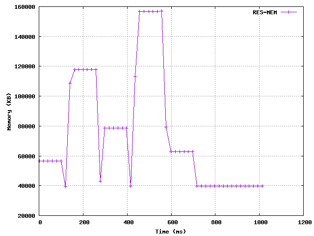

# Memory monitoring shell script
We write a simple shell script for monitoring the resident memory used by a
process as a function of time.

## Usage
`mem-monitor.sh` outputs a text file monitoring the resident memory usage of a
process.

```sh
mem-monitor pid length interval fileout
```

With:
  - **pid**: The pid of the process to monitor.
  - **length**: The length of time during which the process is monitored. 
In *milliseconds*.
  - **interval**: The time sampling step. In *milliseconds*.
  - **fileout**: The path to output file. The provided file is superseded if it
already exists.

The output is two columns, separated by spaces, with a header.
For n sample points:

```text
time res-mem
time-1 res-mem-1
time-2 res-mem-2
...
time-n res-mem-n
```

With:
  * *time-i*: The series of **dates**, in *milliseconds* since beginning of
              script.
  * *res-mem-i*: The amount of **resident memory** the process takes up.
In *KB*. See below for exact definition.

## Example 1
The command:

```sh
mem-monitor $(pidof firefox | cut -d" " -f1) 1000 100 ~/repos/mem-monitor/test.txt
```

Generates the file:

```text
time res-mem
2 378016
105 378016
209 378016
312 378016
415 378016
519 378016
622 378016
726 378016
830 378016
933 378016
1037 378016
```

## Example 2
This script was actually written for the following use case.
We launch the script from inside SBCL just before a call for a function which
we want to monitor for RAM usage. Let's show an example of declaring arrays of
various sizes on top of each other. Note that we call the garbage collector
explicitely between each array re-declaration, the default behaviour being to
leave the RAM alone and fill it up as long as some threshold isn't reached.

```common-lisp
(sb-ext:run-program "mem-monitor"
		    (list "$(pidof sbcl)" "1000" "10"
			  "/home/modi/repos/mem-monitor/test.txt")
		    :wait nil :search T)

(loop for mem in '(2 10 5 15 3) do
  (let ((arr nil))
    (setf arr (make-array (* mem 1000000) :element-type 'double-float
					  :initial-element 0d0))
    (loop for i from 0 below (length arr) do
      (setf (aref arr i) 1d0))
    (sleep 0.1))
      (sb-ext:gc :full t))
```

A `test.txt` file is generated and we can plot the data using gnuplot
and the small script `disp.gp`:

```sh
gnuplot -persistent disp.gp
```



## Measuring resident memory usage
As seen in the linux documentation, the location `/proc/[pid]/statm`
holds data about the memory usage of the process. The second number is the
number of pages used as resident memory. We get the size of a page in bytes
with `getconf PAGESIZE`.

## Tests
Passes:

```sh
shellcheck -s sh -S style mem-monitor.sh
```

## Relevance
While it was a good exercise to piece together this script, it seems that there
must be some existing basic UNIX utility for doing this. A full-fledged utility
would have proper error handling and input sanitization that would make it
safer to use. If you know then please tell me.

## References
  * https://stackoverflow.com/questions/10400751/how-do-vmrss-and-resident-set-size-match
  * http://man7.org/linux/man-pages/man5/proc.5.html
